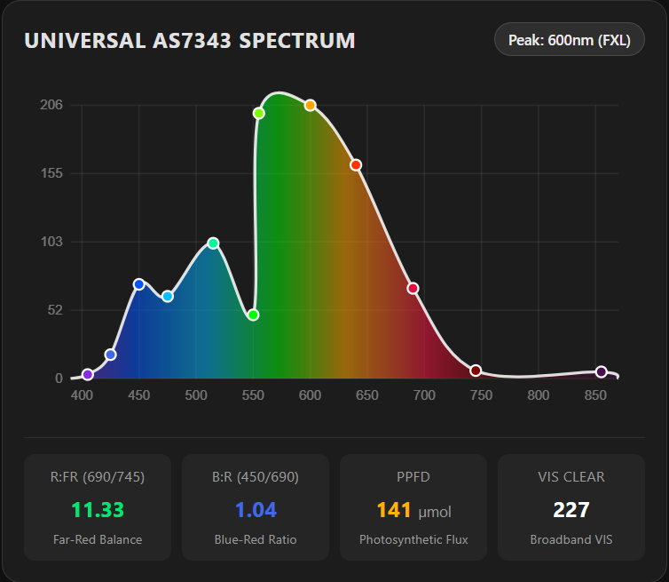

# ESPHome Component for ams-OSRAM AS7343 Spectral Sensor

[](https://opensource.org/licenses/MIT)

A custom ESPHome external component for the **ams-OSRAM AS7343 14-channel multi-spectral sensor**.

The AS7343 is an I2C spectral sensor covering visible and near-infrared light bands. Useful for grow light monitoring, plant canopy analysis, aquarium lighting, and DIY optical experiments.

---

## Features

- **14 Optical Channels**: Reports raw ADC counts for F1 (405nm), F2 (425nm), FZ (450nm), F3 (475nm), F4 (515nm), F5 (550nm), FY (555nm), FXL (600nm), F6 (640nm), F7 (690nm), F8 (745nm), NIR (855nm), and Clear (VIS).
- **Auto-SMUX Mode**: Uses 18-channel Auto-SMUX (`CFG20 = 0xD6 = 0x60`) to cycle through internal photodiode banks.
- **Single 36-Byte Burst Read**: Reads the full 18-channel FIFO frame (`0x95`..`0xB8`) in one continuous I2C transaction.
- **Hardware Latch & Glitch Filter**: Latches registers via `ASTATUS` (`0x94`) and filters corrupted frames.
- **Calculated Ratios & Estimation**:
  - **R:FR Ratio** ($F7 / F8$ – Red to Far-Red ratio).
  - **B:R Ratio** ($FZ / F7$ – Blue to Red ratio).
  - **PAR Proxy** (Sum of channels in the 400–700nm range).
  - **Estimated PPFD** (Simple scalar multiplier to approximate $\mu\text{mol}/(\text{m}^2\cdot\text{s})$ from raw counts).

---

## Hardware Wiring

The AS7343 operates on 3.3V and communicates over I2C (Address: `0x39`).

| AS7343 Pin | ESP32 / ESP32-S3 Pin | Notes |
| :--- | :--- | :--- |
| **VIN** | `3.3V` | 3.3V Power rail |
| **GND** | `GND` | Ground |
| **SDA** | `GPIO8` (or your SDA pin) | I2C Data Line (4.7k pull-up recommended) |
| **SCL** | `GPIO9` (or your SCL pin) | I2C Clock Line (4.7k pull-up recommended) |

> **Recommended I2C Bus Frequency**: `50kHz` for reliable multi-byte burst reads.

---

## Installation & Usage

### Method 1: External Component (Recommended)

Add this repository under `external_components` in your ESPHome YAML:

```yaml
external_components:
  - source:
      type: git
      url: https://github.com/burymichu/esphome-as7343
      ref: main
    components: [ as7343 ]

i2c:
  sda: GPIO8
  scl: GPIO9
  scan: true
  frequency: 50kHz

as7343:
  id: my_as7343
  gain: 1X
  atime: 29
  astep: 599
  update_interval: 5s

sensor:
  - platform: as7343
    as7343_id: my_as7343
    ppfd_factor: 0.150
    f1:
      name: "AS7343 F1 (405nm Violet)"
    f2:
      name: "AS7343 F2 (425nm Indigo)"
    fz:
      name: "AS7343 FZ (450nm Blue)"
    f3:
      name: "AS7343 F3 (475nm Cyan-Blue)"
    f4:
      name: "AS7343 F4 (515nm Cyan)"
    f5:
      name: "AS7343 F5 (550nm Green)"
    fy:
      name: "AS7343 FY (555nm Wide Green)"
    fxl:
      name: "AS7343 FXL (600nm Orange)"
    f6:
      name: "AS7343 F6 (640nm Red)"
    f7:
      name: "AS7343 F7 (690nm Deep Red)"
    f8:
      name: "AS7343 F8 (745nm Far-Red)"
    nir:
      name: "AS7343 NIR (855nm Near-Infrared)"
    clear:
      name: "AS7343 VIS (Visible Clear)"
    r_fr:
      name: "R:FR Ratio"
    b_r:
      name: "B:R Ratio"
    par_proxy:
      name: "PAR Proxy"
    ppfd:
      name: "Estimated PPFD"
```

### Method 2: Standalone Zero-Dependency YAML (Drop-in)

If you prefer not to use external git components, a standalone configuration using native ESPHome `i2c_device` and an embedded lambda script is provided in:
👉 [`examples/spectrometer-standalone.yaml`](examples/spectrometer-standalone.yaml)

---

## Companion Frontend Card

To visualize the spectral curve in Home Assistant Lovelace with continuous Catmull-Rom spline curves and photobiological evaluation badges, check out the companion card:
👉 [as7343-spectrum-card](https://github.com/burymichu/as7343-spectrum-card)



---

## License

MIT License - see [LICENSE](LICENSE) for details.
